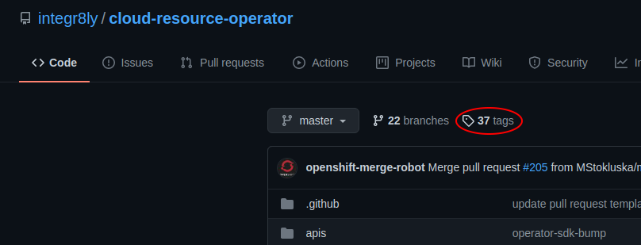
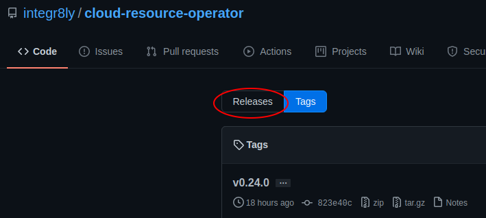
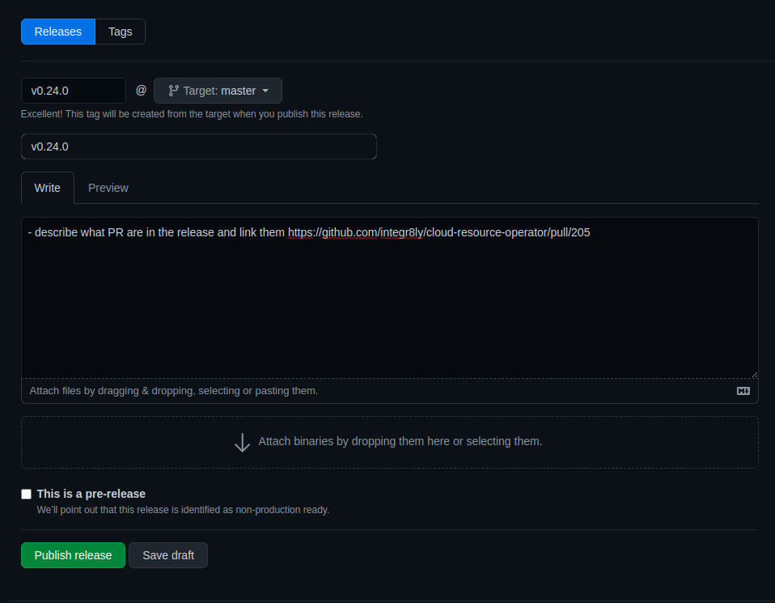

# Cloud Resource Operator

[](https://coveralls.io/github/integr8ly/cloud-resource-operator)

Operator to provision resources such as Postgres, Redis and storage for you, either in-cluster or through a cloud
provider such as Amazon AWS.

This operator depends on the [Cloud Credential Operator](https://github.com/openshift/cloud-credential-operator) for
creating certain resources such as Amazon AWS Credentials. If using the AWS provider, ensure the Cloud Credential
Operator is running.

***Note: This operator is in the very early stages of development. There will be bugs and regular breaking changes***

## Supported Cloud Resources
| Cloud Resource 	| Openshift 	| AWS 	|
|:--------------:	|:---------:	|:---------:	|
|  [Blob Storage](./doc/blobstorage.md)  	|     :x:     	| :heavy_check_mark: 	|
|     [Redis](./doc/redis.md)  	|     :heavy_check_mark:     	|  :heavy_check_mark: 	|
|   [PostgreSQL](./doc/postgresql.md) 	|     :heavy_check_mark:     	|  :heavy_check_mark:  	|
|      [SMTP](./doc/smtp.md)     	|     :x:     	|  :heavy_check_mark:  	|

## Running the Cloud Resource Operator
## Locally

## Supported Openshift Versions

Due to a change in how networking is configured for Openshift >= v4.4.6 the use of cro <= v0.16.1 with these Openshift versions is unsupported.
Please use >= v0.17.x of CRO for Openshift >= v4.4.6.


Prerequisites:
- `go`
- `make`
- `yq` version 3.x.x 
- [git-secrets](https://github.com/awslabs/git-secrets) - for preventing cloud-provider credentials being included in 
commits

Ensure you are running at least `Go 1.13`.
```shell script
$ go version
go version go1.13 darwin/amd64
```

If not, ensure Go Modules are enabled.

Clone this repository into your working directory, outside of `$GOPATH`. For example:
```shell script
$ cd ~/dev
$ git clone git@github.com:integr8ly/cloud-resource-operator.git
```

Seed the Kubernetes/OpenShift cluster with required resources:
```shell script
$ make cluster/prepare
```

Run the operator:
```shell script
$ make run
```

Clean up the Kubernetes/OpenShift cluster:
```shell script
$ make cluster/clean
```

## Snapshots
The cloud resource operator supports the taking of arbitrary snapshots in the AWS provider for both `Postgres` and `Redis`. To take a snapshot you must create a `RedisSnapshot` or `PostgresSnapshot` resource, which should reference the `Redis` or `Postgres` resource you wish to create a snapshot of. The snapshot resource must also exist in the same namespace.
```
apiVersion: integreatly.org/v1alpha1
kind: RedisSnapshot
metadata:
  name: my-redis-snapshot
spec:
  # The redis resource name for the snapshot you want to take
  resourceName: my-redis-resource

```  
*Note* You may experience some downtime in the resource during the creation of the Snapshot

## Skip Create
The cloud resource operator continuously reconciles using the strat-config as a source of truth for the current state of the provisioned resources. Should these resources alter from the expected the state the operator will update the resources to match the expected state.  

There can be circumstances where a provisioned resource would need to be altered. If this is the case, add `skipCreate: true` to the resources CR `spec`. This will cause the operator to skip creating or updating the resource. 

## Deployment
The operator expects two configmaps to exist in the namespace it is watching. These configmaps provide the configuration needed to outline the deployment methods and strategies used when provisioning cloud resources.

### Provider configmap
The `cloud-resource-config` configmap defines which provider should be used to provision a specific resource type. Different deployment types can contain different `resource type > provider` mappings.
An example can be seen [here](deploy/examples/cloud_resource_config.yaml).
For example, a `workshop` deployment type might choose to deploy a Postgres resource type in-cluster (`openshift`), while a `managed` deployment type might choose `AWS` to deploy an RDS instance instead. 

### Strategy configmap
A config map object is expected to exist for each provider (Currently `AWS` or `Openshift`) that will be used by the operator. 
This config map contains information about how to deploy a particular resource type, such as blob storage, with that provider. 
In the Cloud Resources Operator, this provider-specific configuration is called a strategy. An example of an AWS strategy configmap can be seen [here](deploy/examples/cloud_resources_aws_strategies.yaml).

### Custom Resources
With `Provider` and `Strategy` configmaps in place, cloud resources can be provisioned by creating a custom resource object for the desired resource type. 
An example of a Postgres custom resource can be seen [here](./deploy/crds/integreatly_v1alpha1_postgres_cr.yaml). 

Each custom resource contains:
- A `secretRef`, containing the name of the secret that will be created by the operator with connection details to the resource
- A `tier`, in this case `production`, which means a production worthy Postgres instance will be deployed 
- A `type`, in this case `managed`, which will resolve to a cloud provider specified in the `cloud-resource-config` configmap

```yaml
spec:
  # i want my postgres storage information output in a secret named `example-postgres-sec`
  secretRef:
    name: example-postgres-sec
  # i want a postgres storage of a development-level tier
  tier: production
  # i want a postgres storage for the type managed
  type: managed
```

## Resource tagging
Postgres, Redis and Blobstorage resources are tagged with the following key value pairs

```bash
integreatly.org/clusterID: #clusterid
integreatly.org/product-name: #rhmi component product name
integreatly.org/resource-type: #managed/workshop 
integreatly.org/resource-name: #postgres/redis/blobsorage
```

AWS resources can be queried via the aws cli with the cluster id as in the following example
```bash
# clusterid aucunnin-ch5dc
aws resourcegroupstaggingapi get-resources --tag-filters Key=integreatly.org/clusterID,Values=aucunnin-ch5dc | jq
```

## Development

### Contributing

### Testing
To run e2e tests from a built image:
```
$ make test/e2e/image IMAGE=<<built image>>
```
To run e2e tests locally:
```
$ make test/e2e/local
```
To run unit tests:
```
$ make test/unit
```

- Write tests
- Implement changes
- Run code fixer, `make code/fix`
- Run tests, `make test/unit`
- Make a PR


### Releasing

Cut a release on Github you need to be an [owner](OWNERS)

- On github ui select on tags 


- Select Releases on then next screen



- On the Release list screen select `Draft a new release` button 


- On the Draft release screen add a tag, description and add the PR for the release and select `Publish release`



Update the operator version in the following files:

* Update `VERSION`, `PREV_VERSION` and `PREVIOUS_OPERATOR_VERSIONS` in the [Makefile](Makefile) 

* Generate a new cluster service version:
```sh
make gen/csv
```
* Generate a new bundle and push it to your registry
```sh
make create/olm/bundle
```
NOTE: Make sure that the  `VERSION`, `PREV_VERSION` and `PREVIOUS_OPERATOR_VERSIONS` in the [Makefile](Makefile) are updated correctly.

* Generate and push new image, bundle and index
```sh
make release/prepare
```
NOTE: Make sure that the  `VERSION`, `PREV_VERSION` and `PREVIOUS_OPERATOR_VERSIONS` in the [Makefile](Makefile) are updated correctly.

Example:
Starting image for the bundles is 0.23.0, if you are releasing version 0.24.0, ensure that the `PREV_VERSION` is set to `0.23.0`, `VERSION` is set to `0.24.0`
and `PREVIOUS_OPERATOR_VERSIONS` contain coma seperated list of all previous bundles, in this example it would contain only `0.23.0`.

### Terminology
- `Provider` - A service on which a resource type is provisioned e.g. `aws`, `openshift`
- `Resource type` - Something that can be requested from the operator via a custom resource e.g. `blobstorage`, `redis`
- `Resource` - The result of a resource type created via a provider e.g. `S3 Bucket`, `Azure Blob`
- `Deployment type` - Groups mappings of resource types to providers (see [here](deploy/examples/cloud_resource_config.yaml)) e.g. `managed`, `workshop`. This provides a layer of abstraction, which allows the end user to not be concerned with _which_ provider is used to deploy the desired resource. 
- `Deployment tier` - Provides a layer of abstraction, which allows the end user to request a resource of a certain level (for example, a `production` worthy Postgres instance), without being concerned with provider-specific deployment details (such as storage capacity, for example). 

### Design
There are a few design philosophies for the Cloud Resource Operator:
- Each resource type (e.g. `BlobStorage`, `Postgres`) should have its own controller
- The end-user should be abstracted from explicitly specifying how the resource is provisioned by default
    - What cloud-provider the resource should be provisioned on should be handled in pre-created config objects
- The end-user should not be abstracted from what provider was used to provision the resource once it's available
    - If a user requests `BlobStorage` they should be made aware it was created on `Amazon AWS`
- Deletion of a custom resource should result in the deletion of the resource in the cloud-provider